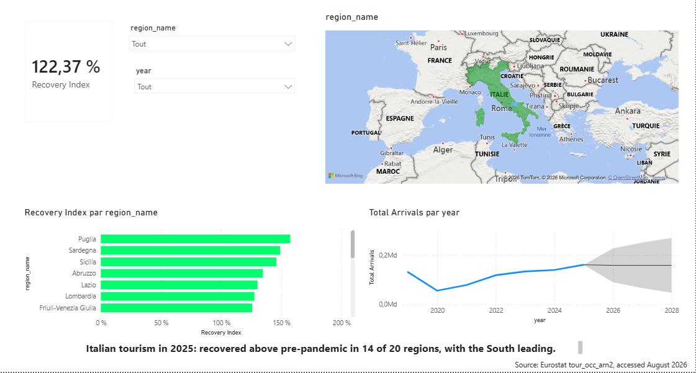

# Italian Tourism Recovery Dashboard (SQL + Power BI)

**Question:** Which Italian regions had the steepest tourism recovery 2022 → 2025?

**Headline finding:** Italian tourism fully recovered by 2025 with 14 of 20 regions exceeding pre-pandemic levels, heavily led by Southern regions like Puglia and Sicilia.

## Tech
- DuckDB + SQL (CTEs, pivots, ratio analysis)
- Power BI Desktop with DAX measures
- Python (only for the Eurostat TSV ingest)

## Reproduce
1. Clone this repo
2. `pip install -r requirements.txt`
3. Download `tour_occ_arn2.tsv` from [Eurostat](https://ec.europa.eu/eurostat/databrowser/view/tour_occ_arn2/default/table) into `data/raw/`
4. `python ingest/load_eurostat.py`
5. `duckdb data/tourism.duckdb < sql/01_stg_tourism.sql sql/02_dim_region.sql sql/03_fct_yearly_arrivals.sql`
6. Open `powerbi/tourism_recovery.pbix` and refresh

## Findings
**Situation:** Italian regional tourism recovery has been overall strong yet uneven across the territory since the 2020 collapse.  
**Complication:** Eurostat data shows that as of 2025, 14 of 20 regions have surpassed their 2019 baseline, while 6 regions remain below pre-pandemic volumes, struggling to regain momentum.  
**Question:** Where should commercial operators prioritize expansion given this structural shift in visitor behavior?  
**Answer:** The South of Italy (Puglia, Sicilia, Sardegna) outpaced the North for the first time in modern record, while recovery lags in northern regions like Trentino and Valle d'Aosta, suggesting untapped headroom and value opportunities in underperforming northern hubs.

## Data source
[Eurostat — Arrivals at tourist accommodation establishments by NUTS 2 region](https://ec.europa.eu/eurostat/databrowser/view/tour_occ_arn2/default/table) (CC-BY 4.0).
